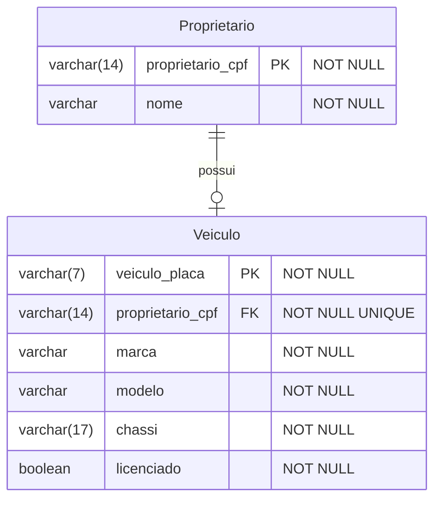

# 🚀 Cadastro de Veículos

Este repositório é uma API de cadastro de veículo desenvolvido utilizando Java, Spring Boot, Docker e PostgreSQL. Ela consome uma API externa para poder realizar o cadastro do veículo.

## Arquitetura

### Modelo Entidade Relacionamento

O sistema tem duas entidades: Proprietario e Veiculo com relação de um para um. Veja no modelo ERD a seguir.



## ENDPOINTS

### Proprietario

A API consiste de um CRUD completo de Proprietario com os seguintes endpoints:

### `POST /proprietario`

**Request**

```json
{
  "cpf": "XXX.XXX.XXX-XX",
  "nome": "John Doe"
}
```

**Response**

```json
{
  "nome": "John Doe"
}
```

### `GET /proprietario`

**Request**

```json
{
  
}
```

**Response**

```json
[
  {
    "cpf": "XXX.XXX.XXX-XX",
    "nome": "John Doe"
  },
  {
    "cpf": "YYY.YYY.YYY-YY",
    "nome": "Jane Doe"
  }
]
```

### `GET /proprietario/{cpf}`

**Request**

```json
{
  
}
```

**Response**

```json
{
  "cpf": "XXX.XXX.XXX-XX",
  "nome": "John Doe"
}
```

### `PUT /proprietario/{cpf}`

**Request**

```json
{
  "nome": "John Doe"
}
```

**Response**

```json
{
  "nome": "John Doe"
}
```

### `DELETE /proprietario/{cpf}`

**Request**

```json
{
  
}
```

**Response**

```json
{
  
}
```

### Veiculo

O veiculo contem apenas dois endpoints; um para criação e um para consulta:

### `POST /veiculo`

**Request**

```json
{
  "cpf": "XXX.XXX.XXX-XX",
  "placa": "ABC1234"
}
```

**Response**

```json
{   
  "placa" : "ABC1234",
  "cpf" : "XXX.XXX.XXX-XX",
  "marca": "Chevrolet",
  "modelo": "Suburban 1500",
  "chassi": "5TDBKRFH2FS979708",
  "licenciado": true
}
```

### `GET /veiculo/{placa}`

**Request**

```json
{
  
}
```

**Response**

```json
{   
  "placa" : "ABC1234",
  "cpf" : "XXX.XXX.XXX-XX",
  "marca": "Chevrolet",
  "modelo": "Suburban 1500",
  "chassi": "5TDBKRFH2FS979708",
  "licenciado": true
}
```


## Pré-requisitos

Antes de começar, verifique se você possui as seguintes ferramentas instaladas em sua máquina:

✅ Docker
✅ JDK 21+

## Passo 1️⃣: Clonar o repositório

Comece clonando este repositório para sua máquina local. Para clonar o repositório, clique no botão "Clone" acima ou execute o seguinte comando no terminal:

```bash
   git clone https://github.com/devrafael-santos/CadastroVeiculo.git
```

Isso criará uma cópia local do repositório em seu ambiente.

## Passo 2️⃣: Configurar variáveis de ambiente e iniciar os contêineres Docker

Primeiro, crie um arquivo ``.env.dev.local`` em seu diretório raiz e adicione as seguintes variáveis:

POSTGRES_DB= [Nome do banco de dados.]  
POSTGRES_DB_URL= [URL de conexão do banco de dados.]  
POSTGRES_USER= [Usuário o banco de dados]  
POSTGRES_PASSWORD= [Senha do banco de dados]

Navegue até o diretório raiz do projeto e execute o seguinte comando para iniciar os contêineres Docker:

```bash
   docker-compose --env-file .env.dev.local up
```

🐳 Isso iniciará o contêiner do PostgreSQL para o projeto.

## Passo 3️⃣: Acessar a API

Após iniciar os contêineres, você pode fazer as requisições através do seu navegador (ou alguma aplicação) no endereço [http://localhost:8080/api/v1/].


🎉 Espero que este guia passo a passo tenha sido útil para você! 😄
